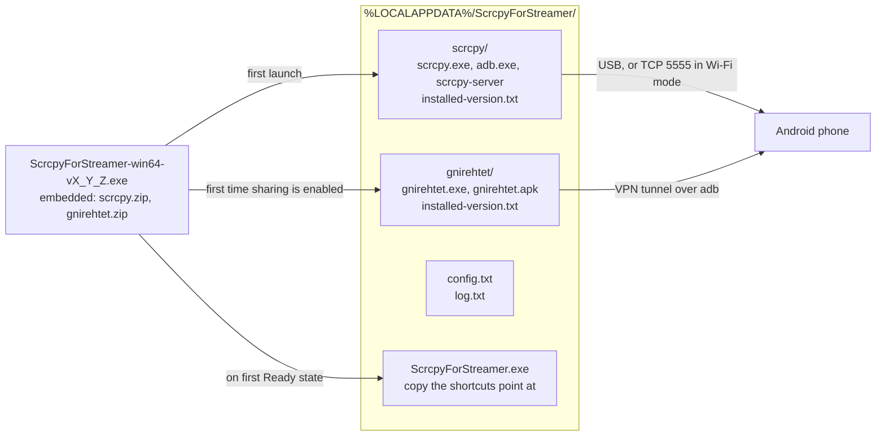

# ScrcpyForStreamer

**ScrcpyForStreamer — a scrcpy installer for streamers: it sets scrcpy up itself and brings an Android phone's screen and audio to a Windows PC over USB.**

[](https://github.com/maximspr/ScrcpyForStreamer/releases)
[](LICENSE)
[](#requirements)

🇷🇺 **[Читать по-русски](README.ru.md)**

In essence the program is an installer for [scrcpy](https://github.com/Genymobile/scrcpy).
scrcpy and `adb` are embedded in the single executable; on first launch it unpacks them into the
user profile, puts a copy of itself there and creates two desktop shortcuts. Nothing is downloaded
and administrator rights are not needed.

After that it works as a graphical shell over scrcpy. The wizard detects what is missing — cable,
USB debugging, permission on the phone — and shows what to do, with menu paths matched to the
phone's brand. USB debugging has to be enabled on the phone once; Android provides no way around
that. A phone that has been set up is remembered, and the next launch starts the stream without
further input.

The picture and sound arrive on the PC as an ordinary window and an ordinary audio stream, which
OBS and other recording software capture like any other window — that is what the program is for.

> [!NOTE]
> Earlier versions were called **Phone Screen** and kept their data in
> `%LOCALAPPDATA%\PhoneScreen\`. On first launch the new version moves the settings across —
> the remembered phone and its encoder are preserved — removes the old desktop shortcuts and
> deletes the old folder.

---

## Features

Everything listed here is implemented in [`ScrcpyForStreamer.cs`](ScrcpyForStreamer.cs).

| | Feature |
|---|---|
| 📱 | Screen mirroring over USB, H.264 by default |
| 📦 | Single self-contained `.exe` — scrcpy, `adb` and gnirehtet are embedded and extracted on first run |
| 🔓 | No installer and no administrator rights; everything lives in the user profile |
| 🧭 | Step-by-step wizard covering 20 states: no cable, USB debugging off, unauthorised device, offline device, several devices, ADB version conflict, unknown phone, Apple device |
| 🏷️ | Brand-aware help — 23 vendor families recognised, with dedicated "enable developer mode" paths for Xiaomi, Samsung, vivo, OPPO/realme/OnePlus, Huawei/Honor and Meizu |
| ⚙️ | Automatic hardware encoder selection, scored per chipset; software-only encoders are rejected |
| 🎞️ | Five video codecs — H.264, H.265, AV1, VP8, VP9 — with automatic fallback to H.264 when the phone has no hardware encoder for the chosen one |
| 🔊 | Four audio codecs — Opus, AAC, FLAC, raw — plus routing to PC, to PC and phone, or muted |
| 🤖 | Audio mode chosen automatically from the Android version: 13+ → PC and phone, 11+ → PC only, older → muted |
| 🔌 | Distinguishes a direct cable from a USB hub and says which one is in use |
| 🖥️ | Window options: fullscreen, always on top, borderless |
| 🖱️ | Optional control from the PC with mouse and keyboard, keep-awake and phone-screen-off |
| 📡 | Optional connection over Wi-Fi, behind two warnings |
| 🌐 | Optional reverse tethering — the phone takes internet from the PC — behind two warnings |
| 🔁 | Closes itself 6 seconds after the cable is pulled; plugging back in cancels it |
| 🌍 | Bilingual interface, English and Russian, chosen by system language and switchable |
| 🔗 | Creates two desktop shortcuts — the app and its settings — recreatable from the settings window |

### Settings reference

Defaults are marked in **bold**.

| Setting | Available values |
|---|---|
| Size | no downscale · 1280 · 1600 · **1920** · 2560 px |
| Frame rate | 30 · 45 · **60** · 90 · 120 · unlimited fps |
| Bit rate | 4 · 6 · 8 · 12 · 16 · **20** · 30 Mbps |
| Video codec | **H.264** · H.265 · AV1 · VP8 · VP9 |
| Audio codec | **Opus** · AAC · FLAC · raw |
| Audio output | **automatic** · PC and phone · PC only · muted |
| Window | fullscreen · always on top · borderless (all **off**) |
| Control | control from PC · keep awake · turn phone screen off (all **off**) |
| Close when unplugged | **on** |
| Language | **follow system** · Русский · English |

`Keep awake` and `turn phone screen off` are only available together with control from the PC —
scrcpy rejects them otherwise.

---

## Requirements

### To run

| | |
|---|---|
| OS | Windows 10 or 11, 64-bit |
| Runtime | .NET Framework **4.5 or newer** — Windows 10 and 11 ship with 4.8 |
| Phone | Android with a **hardware H.264 encoder** (almost any) |
| Cable | A USB cable that carries data, not charge-only. A hub works if the port carries data |

The program refuses to start mirroring on a phone that offers only software encoders: they load
the phone's CPU, it heats up and the picture stutters.

> [!IMPORTANT]
> iPhone and iPad are **not supported**. This is a restriction inside iOS itself, not a missing
> feature — no program on Windows can mirror them over a cable. The wizard detects Apple devices
> and says so instead of failing silently.

### To build

| | |
|---|---|
| OS | Windows — the build calls `csc.exe` directly |
| Compiler | `csc.exe` from .NET Framework 4, already present in `%WINDIR%\Microsoft.NET\Framework64\v4.0.30319\` |
| Everything else | Already in this repository — see [Build](#build) |

There is no `.csproj`, no MSBuild and no NuGet. `dotnet build`, `msbuild` and `mono` do not apply.

---

## Installation

1. Download `ScrcpyForStreamer-win64-*.exe` from [Releases](https://github.com/maximspr/ScrcpyForStreamer/releases).
2. Double-click it. There is no installer.

On first launch Windows SmartScreen may show *"Windows protected your PC"* — expected for an
unsigned program. Click **More info**, then **Run anyway**. See [Security](#security).

The first run unpacks scrcpy into `%LOCALAPPDATA%\ScrcpyForStreamer\`. Once the phone is ready, the
program copies itself there and puts two shortcuts on the desktop, so the downloaded file can be
deleted afterwards.

---

## Usage

1. Start the program and plug the phone into the PC with a USB cable.
2. Follow the window. It detects the current state by itself and explains what to do — enabling
   developer mode, turning on USB debugging, tapping **Allow** on the phone.
3. When it says **Ready**, press **Show screen**. The picture opens in a separate window.
4. The main window can be closed; the stream keeps running.

A phone that has been set up once is remembered — on the next launch mirroring starts on its own.

### Advanced modes

Both are optional, off by default, and each is behind two confirmation dialogs.

**Connection over Wi-Fi.** Switches the phone to ADB over TCP so the cable can be unplugged.
The picture is noticeably worse than over cable, and size and bit rate are capped at 1600 px and
8 Mbps while it is on.

> [!WARNING]
> This mode runs `adb tcpip 5555`, which makes the phone accept debugging connections from **any
> host on the network** until the phone is rebooted. **Back to cable** ends the PC's connection
> but does not close that port. Avoid untrusted networks — public Wi-Fi, coworking, hotels —
> while the mode is on, and reboot the phone to close it.

**Internet for the phone.** Reverse tethering through
[gnirehtet](https://github.com/Genymobile/gnirehtet): the phone routes its traffic through the
cable to the PC instead of using its own Wi-Fi. A small app by the scrcpy authors is installed on
the phone and Android shows a VPN consent dialog once. If the cable is pulled the phone loses
internet for a moment — an online match would drop. The program removes the VPN automatically
when the phone disappears or the window closes.

The two advanced modes are mutually exclusive.

---

## Limitations

Stated plainly so nothing here is a surprise:

- **Windows only.** The UI is WinForms and device detection uses WMI.
- **Android only.** iPhone and iPad cannot work — see [Requirements](#requirements).
- **A hardware H.264 encoder is required.** Phones offering only software encoders are refused.
- **Wi-Fi mode drops after a phone reboot** and can only be re-enabled with the cable.
- **Wi-Fi mode and internet sharing cannot be used together.**
- **One phone at a time.** With several devices connected the wizard asks to unplug the extras.
- **Not everything scrcpy can do is exposed.** Recording, cropping, screenshots, camera mirroring,
  OTG mode, clipboard options and custom shortcuts are not wired into the interface.
- **The release binary is not code-signed.**
- **No automated tests.** See [Contributing](#contributing).

---

## Architecture

One process, one source file, three layers with a deliberately narrow seam between logic and UI:
`Engine.Poll()` returns a `Snapshot`, and `Engine` never references a form.



A background thread polls `adb devices -l` once per second, maps the result onto one of 20 wizard
states and hands it to the UI thread. The whole working directory can be deleted at any time — the
program recreates it.

📖 A fuller map, including what must stay in sync when dependencies change, is in
**[docs/PROJECT_MAP.md](docs/PROJECT_MAP.md)**.

### Project structure

```
ScrcpyForStreamer/
├── ScrcpyForStreamer.cs                 # the entire program — WinForms, .NET Framework 4.5+
├── build.bat                            # build via csc.exe
├── app.ico                              # icon, 7 sizes, embedded with /win32icon
├── deps/
│   ├── scrcpy-win64-v4.1.zip            # official build, embedded as scrcpy.zip
│   ├── gnirehtet-rust-win64-v2.5.1.zip  # official build, embedded as gnirehtet.zip
│   └── SHA256SUMS.txt                   # checksums, verified by CI before every build
├── .github/workflows/release.yml        # build and publish a release from a tag
├── docs/PROJECT_MAP.md                  # architecture map for developers
├── README.md, README.ru.md              # this file and its Russian mirror
├── LICENSE                              # MIT — this program's own code
├── LICENSE-scrcpy.txt                   # Apache 2.0 — bundled scrcpy
└── LICENSE-gnirehtet.txt                # Apache 2.0 — bundled gnirehtet
```

### Entry points

`Program.Main` is the only entry point. It runs in one of two modes, each guarded by its own
mutex, so both can be open at once:

| Started as | Window | Mutex |
|---|---|---|
| no arguments | main wizard | `Local\ScrcpyForStreamer_main` |
| `--settings` | settings only | `Local\ScrcpyForStreamer_settings` |

The two desktop shortcuts correspond exactly to these two modes.

---

## Build

Everything the build needs is already in the repository — nothing is downloaded.

```bat
build.bat                    :: -> dist\ScrcpyForStreamer-win64-v1_0_0.exe
set VER=1_0_2 && build.bat   :: with an explicit version
```

The build is a single `csc.exe` invocation that embeds both archives as resources and the icon as
the Win32 icon.

> [!CAUTION]
> `ScrcpyForStreamer.cs` is UTF-8 **without BOM** and contains hundreds of Russian string literals.
> Without `/codepage:65001` the legacy compiler reads it in the system ANSI code page and the whole
> interface becomes mojibake — **and the build still succeeds**. Never add a BOM, never re-save the
> file in another encoding, and never remove that flag. CI guards this by searching the built
> executable for a known UTF-16 string.

If you have no Windows machine, run the workflow manually — see below — and take the executable
from the run's artifacts.

---

## Releases

```bash
git tag -a 1.0.2 -m "ScrcpyForStreamer 1.0.2"
git push origin 1.0.2
```

CI does the rest. The tag uses dots and no `v` prefix; the release file name uses underscores;
the conversion is automatic.

A manual run has no tag, so the version comes from your published releases: the newest one is
found and its patch number incremented. With `1.0.1` released, a manual build produces
`ScrcpyForStreamer-win64-v1_0_2.exe` — exactly the name it will carry once that version is
tagged. If there are no releases yet it starts at `1.0.0`.

### CI/CD

One workflow, [`.github/workflows/release.yml`](.github/workflows/release.yml), on
`windows-latest`, triggered by a version tag or manually. A manual run builds and uploads the
artifact without publishing a release, naming it after the next version.

| Step | Fails when |
|---|---|
| Verify archive checksums against `deps/SHA256SUMS.txt` | a checksum does not match |
| Verify dependency versions against the constants in the source | `Paths.Version` / `Paths.NetVersion`, the archive name and `build.bat` disagree |
| Determine the version — from the tag, or the next one after the latest release | — |
| Build via `build.bat` | the compiler returns an error |
| Verify Cyrillic survived in the built `.exe` | the encoding flag was lost |
| Upload the artifact | no executable was produced |
| Publish the release | *(tag runs only)* |

---

## Dependencies

The program has **no runtime dependencies to install** and **downloads nothing** — it contains no
network client code at all. Both tools below are official, unmodified builds embedded at build time.

| Component | Version | License | Role |
|---|---|---|---|
| [scrcpy](https://github.com/Genymobile/scrcpy) | 4.1 | Apache 2.0 | screen mirroring; also supplies `adb` |
| [gnirehtet](https://github.com/Genymobile/gnirehtet) | 2.5.1 | Apache 2.0 | reverse tethering |

### Verifying the bundled archives

`deps/SHA256SUMS.txt` matches the `SHA256SUMS.txt` published by Genymobile for
[scrcpy v4.1](https://github.com/Genymobile/scrcpy/releases/tag/v4.1) and
[gnirehtet v2.5.1](https://github.com/Genymobile/gnirehtet/releases/tag/v2.5.1), so the archives
here can be traced back to the official releases. Upstream additionally signs those checksum files
(`SHA256SUMS.txt.asc`).

```bash
cd deps && sha256sum -c SHA256SUMS.txt
```

CI runs the same check before every build.

### Inside the scrcpy distribution

scrcpy ships prebuilt libraries that carry their own licenses. They are redistributed exactly as
Genymobile packaged them. Versions are those listed in the scrcpy v4.1 release notes:

| Component | Version | License |
|---|---|---|
| FFmpeg — `avcodec`, `avformat`, `avutil`, `swresample` | 8.1.2 | LGPL-2.1-or-later |
| SDL | 3.4.12 | zlib |
| libusb | 1.0.30 | LGPL-2.1-or-later |
| Android `adb`, `AdbWinApi`, `AdbWinUsbApi` | shipped with scrcpy | Apache 2.0 |

Only .NET Framework class libraries are referenced at compile time: `System`, `System.Core`,
`System.Drawing`, `System.Windows.Forms`, `System.Management`, `System.IO.Compression` and
`System.IO.Compression.FileSystem`.

---

## Security

- **No administrator rights**, at install or at runtime. Everything stays in the user profile.
- **No network listeners and no telemetry.** The program contains no HTTP client; it never phones
  home and never downloads anything. Its only outbound network action is `adb connect` to an
  address the user's own phone reported over USB.
- **Local log.** `%LOCALAPPDATA%\ScrcpyForStreamer\log.txt` is written silently, capped at 512 KB, and
  never transmitted. It contains the device serial number, local IP addresses and your Windows
  user path — worth knowing before attaching it to a bug report. No credentials are logged.
- **Unsigned binary.** Releases are not code-signed, which is why SmartScreen warns about them.
- **Wi-Fi mode opens the phone's debug port** to the local network until the phone reboots — see
  the warning under [Advanced modes](#advanced-modes).

Found a security problem? Please open an issue, or contact the maintainer privately if you
consider it sensitive.

---

## Contributing

Contributions are welcome. Two things are worth knowing before opening a pull request:

- **The encoding rule in [Build](#build) is absolute** — a PR that changes the file's encoding
  silently breaks the interface.
- **The compiler is C# 5.** String interpolation, `nameof`, expression-bodied members, `?.`,
  pattern matching, `out var` and tuples will not compile. Use `string.Format`, explicit null
  checks and full method bodies, matching the surrounding code.

There are no automated tests; the only checks are the CI steps listed above. Changes are verified
by running the workflow.

---

## License

This program's own code is released under the **MIT License** — see [LICENSE](LICENSE).

Bundled third-party components keep their own licenses:

| Component | License | Text | Copyright |
|---|---|---|---|
| scrcpy | Apache License 2.0 | [LICENSE-scrcpy.txt](LICENSE-scrcpy.txt) | © Genymobile / Romain Vimont |
| gnirehtet | Apache License 2.0 | [LICENSE-gnirehtet.txt](LICENSE-gnirehtet.txt) | © Genymobile / Romain Vimont |

Both are redistributed unmodified. The prebuilt libraries inside the scrcpy distribution — FFmpeg,
SDL, libusb and Android `adb` — carry their own separate licenses, listed under
[Dependencies](#inside-the-scrcpy-distribution).

## Acknowledgements

This project exists because of [**scrcpy**](https://github.com/Genymobile/scrcpy) and
[**gnirehtet**](https://github.com/Genymobile/gnirehtet) by Genymobile and Romain Vimont. All the
hard parts — capture, encoding, transport, input injection, tunnelling — are theirs. This
repository only puts a friendly window around them.

**This is not an official Genymobile product and is not affiliated with Genymobile.**

### Related projects

- [QtScrcpy](https://github.com/barry-ran/QtScrcpy) — cross-platform scrcpy GUI in Qt.
- [guiscrcpy](https://github.com/srevinsaju/guiscrcpy) — scrcpy GUI in Python/Qt.
