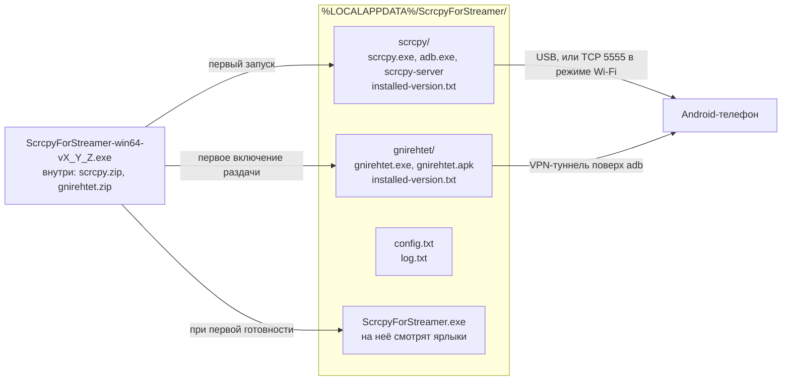

# ScrcpyForStreamer

**ScrcpyForStreamer — установщик scrcpy для стримеров: ставит scrcpy сам и выводит экран и звук Android-телефона на компьютер с Windows через USB.**

[](https://github.com/maximspr/ScrcpyForStreamer/releases)
[](LICENSE)
[](#требования)

🇬🇧 **[Read in English](README.md)**

По сути это установщик [scrcpy](https://github.com/Genymobile/scrcpy). scrcpy и `adb` вшиты
внутрь одного исполняемого файла; при первом запуске программа распаковывает их в профиль
пользователя, кладёт туда свою копию и создаёт два ярлыка на рабочем столе. Ничего не скачивается,
права администратора не нужны.

Дальше она работает как графическая оболочка над scrcpy. Мастер сам определяет, чего не хватает —
кабеля, отладки по USB, разрешения на телефоне — и показывает, что сделать, с путями в меню под
конкретный бренд. Отладку по USB на телефоне нужно включить один раз: обойти это Android не
позволяет. Настроенный телефон запоминается, и при следующем запуске трансляция начинается без
дополнительных действий.

Картинка и звук приходят на компьютер обычным окном и обычным звуковым потоком — OBS и другие
программы записи захватывают их как любое другое окно. Ради этого программа и делалась.

> [!NOTE]
> Прежние версии назывались **Экран телефона** и хранили данные в
> `%LOCALAPPDATA%\PhoneScreen\`. При первом запуске новая версия переносит настройки —
> запомненный телефон и подобранный кодировщик сохраняются, — удаляет старые ярлыки с
> рабочего стола и убирает старую папку.

---

## Возможности

Всё перечисленное реализовано в [`ScrcpyForStreamer.cs`](ScrcpyForStreamer.cs).

| | Возможность |
|---|---|
| 📱 | Показ экрана по USB, по умолчанию H.264 |
| 📦 | Один самодостаточный `.exe` — scrcpy, `adb` и gnirehtet вшиты внутрь и распаковываются при первом запуске |
| 🔓 | Без установщика и без прав администратора, всё лежит в профиле пользователя |
| 🧭 | Пошаговый мастер на 20 состояний: нет кабеля, выключена отладка, неавторизованное устройство, устройство не отвечает, несколько устройств, конфликт версий ADB, незнакомый телефон, устройство Apple |
| 🏷️ | Подсказки под бренд — распознаётся 23 семейства производителей, отдельные инструкции «как включить режим разработчика» для Xiaomi, Samsung, vivo, OPPO/realme/OnePlus, Huawei/Honor и Meizu |
| ⚙️ | Автоподбор аппаратного кодировщика с оценкой под чипсет; программные кодировщики отклоняются |
| 🎞️ | Пять видеокодеков — H.264, H.265, AV1, VP8, VP9 — с автооткатом на H.264, если под выбранный у телефона нет аппаратного кодировщика |
| 🔊 | Четыре аудиокодека — Opus, AAC, FLAC, raw — и выбор, куда идёт звук: в компьютер, в компьютер и телефон, или выключить |
| 🤖 | Режим звука подбирается по версии Android: 13+ — в компьютер и телефон, 11+ — только в компьютер, старее — выключен |
| 🔌 | Отличает прямой кабель от подключения через USB-хаб и показывает, что именно используется |
| 🖥️ | Окно: во весь экран, поверх остальных окон, без рамки |
| 🖱️ | Необязательное управление телефоном с компьютера мышью и клавиатурой, запрет гашения экрана, гашение экрана самого телефона |
| 📡 | Необязательное подключение по Wi-Fi, за двумя предупреждениями |
| 🌐 | Необязательная раздача интернета телефону с компьютера, за двумя предупреждениями |
| 🔁 | Закрывается через 6 секунд после того, как вынули кабель; если воткнуть обратно — отмена |
| 🌍 | Двуязычный интерфейс, русский и английский, по системе и с ручным переключением |
| 🔗 | Создаёт два ярлыка на рабочем столе — программа и настройки, — их можно пересоздать из окна настроек |

### Справочник настроек

Значения по умолчанию выделены **жирным**.

| Настройка | Доступные значения |
|---|---|
| Размер | как есть · 1280 · 1600 · **1920** · 2560 точек |
| Кадры в секунду | 30 · 45 · **60** · 90 · 120 · без ограничения |
| Битрейт | 4 · 6 · 8 · 12 · 16 · **20** · 30 Мбит/с |
| Видеокодек | **H.264** · H.265 · AV1 · VP8 · VP9 |
| Аудиокодек | **Opus** · AAC · FLAC · raw |
| Куда идёт звук | **автоматически** · в компьютер и телефон · только в компьютер · выключить |
| Окно | во весь экран · поверх окон · без рамки (всё **выключено**) |
| Управление | управление с ПК · не давать гаснуть · погасить экран телефона (всё **выключено**) |
| Закрывать при отключении | **включено** |
| Язык | **как в системе** · Русский · English |

«Не давать гаснуть» и «погасить экран телефона» доступны только вместе с управлением
с компьютера — без него scrcpy их отвергает.

---

## Требования

### Для запуска

| | |
|---|---|
| Система | Windows 10 или 11, 64-битная |
| Среда | .NET Framework **4.5 или новее** — на Windows 10 и 11 стоит 4.8 |
| Телефон | Android с **аппаратным кодировщиком H.264** (почти любой) |
| Кабель | USB-кабель, умеющий передавать данные, а не только заряжать. Через хаб работает, если порт для данных |

Программа откажется запускать трансляцию на телефоне, который предлагает только программные
кодировщики: они грузят процессор телефона, он греется и картинка начинает рваться.

> [!IMPORTANT]
> iPhone и iPad **не поддерживаются**. Это ограничение внутри самой iOS, а не недоделка — ни одна
> программа под Windows не выведет их экран по кабелю. Мастер распознаёт устройства Apple и прямо
> об этом говорит, а не падает молча.

### Для сборки

| | |
|---|---|
| Система | Windows — сборка вызывает `csc.exe` напрямую |
| Компилятор | `csc.exe` из .NET Framework 4, уже лежит в `%WINDIR%\Microsoft.NET\Framework64\v4.0.30319\` |
| Всё остальное | Уже есть в репозитории — см. [Сборка](#сборка) |

Ни `.csproj`, ни MSBuild, ни NuGet в проекте нет. `dotnet build`, `msbuild` и `mono` неприменимы.

---

## Установка

1. Скачать `ScrcpyForStreamer-win64-*.exe` из раздела [Releases](https://github.com/maximspr/ScrcpyForStreamer/releases).
2. Запустить двойным кликом. Установщика нет.

При первом запуске Windows SmartScreen может показать «Windows защитила ваш компьютер» — это
ожидаемо для неподписанной программы. Нажать **Подробнее**, затем **Выполнить в любом случае**.
См. [Безопасность](#безопасность).

Первый запуск распаковывает scrcpy в `%LOCALAPPDATA%\ScrcpyForStreamer\`. Когда телефон готов, программа
копирует себя туда же и создаёт два ярлыка на рабочем столе — скачанный файл после этого можно
удалить.

---

## Как пользоваться

1. Запустить программу и подключить телефон к компьютеру USB-кабелем.
2. Дальше следовать окну. Оно само определяет, что происходит, и подсказывает: включить режим
   разработчика, включить отладку по USB, нажать **Разрешить** на телефоне.
3. Когда появится «Готово» — нажать **Показать экран**. Картинка откроется в отдельном окне.
4. Главное окно можно закрыть, на трансляцию это не влияет.

Один раз настроенный телефон запоминается — при следующем запуске трансляция начнётся сама.

### Режимы для опытных

Оба необязательны, по умолчанию выключены, и каждый закрыт двумя подтверждениями.

**Подключение по Wi-Fi.** Переводит телефон на ADB поверх TCP, чтобы можно было отключить кабель.
Картинка заметно хуже, чем по проводу, а размер и битрейт на время режима ограничены 1600 точками
и 8 Мбит/с.

> [!WARNING]
> Режим выполняет `adb tcpip 5555`, после чего телефон принимает подключения отладки **от любого
> узла в сети** — и так до перезагрузки телефона. Кнопка «Вернуться на провод» разрывает
> соединение с компьютером, но этот порт не закрывает. Пока режим включён, лучше не подключаться
> к недоверенным сетям — публичный Wi-Fi, коворкинг, гостиница, — а чтобы закрыть порт,
> перезагрузить телефон.

**Интернет для телефона.** Раздача через
[gnirehtet](https://github.com/Genymobile/gnirehtet): телефон гонит трафик через кабель на
компьютер вместо своего Wi-Fi. На телефон ставится небольшая программа авторов scrcpy, и Android
один раз показывает окно про VPN-подключение. Если выдернуть кабель, телефон на секунду останется
без интернета — сетевая игра в этот момент отвалится. Программа снимает VPN сама, когда телефон
пропадает или окно закрывается.

Два режима для опытных несовместимы между собой.

---

## Ограничения

Названы прямо, чтобы ничто не стало неожиданностью:

- **Только Windows.** Интерфейс на WinForms, определение устройств через WMI.
- **Только Android.** iPhone и iPad работать не могут — см. [Требования](#требования).
- **Нужен аппаратный кодировщик H.264.** Телефоны с одними программными кодировщиками отклоняются.
- **Режим Wi-Fi слетает после перезагрузки телефона**, включить заново можно только кабелем.
- **Режим Wi-Fi и раздача интернета несовместимы.**
- **Один телефон за раз.** Если подключено несколько, мастер просит отключить лишние.
- **В интерфейс выведено не всё, что умеет scrcpy.** Запись видео, обрезка кадра, снимки экрана,
  вывод камеры, режим OTG, работа с буфером обмена и настройка горячих клавиш не проброшены.
- **Релизный файл не подписан цифровой подписью.**
- **Автоматических тестов нет.** См. [Участие в разработке](#участие-в-разработке).

---

## Архитектура

Один процесс, один файл исходников, три слоя с намеренно узким стыком между логикой и
интерфейсом: `Engine.Poll()` возвращает `Snapshot`, и `Engine` не знает о существовании форм.



Фоновый поток раз в секунду опрашивает `adb devices -l`, раскладывает результат в одно из 20
состояний мастера и передаёт его потоку интерфейса. Всю рабочую папку можно удалить в любой
момент — программа создаст её заново.

📖 Подробная карта, включая то, что нужно держать синхронным при обновлении зависимостей, —
в **[docs/PROJECT_MAP.md](docs/PROJECT_MAP.md)**.

### Структура проекта

```
ScrcpyForStreamer/
├── ScrcpyForStreamer.cs                 # вся программа — WinForms, .NET Framework 4.5+
├── build.bat                            # сборка через csc.exe
├── app.ico                              # иконка, 7 размеров, вшивается через /win32icon
├── deps/
│   ├── scrcpy-win64-v4.1.zip            # официальная сборка, вшивается как scrcpy.zip
│   ├── gnirehtet-rust-win64-v2.5.1.zip  # официальная сборка, вшивается как gnirehtet.zip
│   └── SHA256SUMS.txt                   # суммы, сверяются в CI перед каждой сборкой
├── .github/workflows/release.yml        # сборка и публикация релиза по тегу
├── docs/PROJECT_MAP.md                  # карта архитектуры для разработчика
├── README.md, README.ru.md              # этот файл и его русское зеркало
├── LICENSE                              # MIT — код самой программы
├── LICENSE-scrcpy.txt                   # Apache 2.0 — встроенный scrcpy
└── LICENSE-gnirehtet.txt                # Apache 2.0 — встроенный gnirehtet
```

### Точки входа

`Program.Main` — единственная точка входа. Работает в одном из двух режимов, у каждого свой
мьютекс, поэтому оба могут быть открыты одновременно:

| Запуск | Окно | Мьютекс |
|---|---|---|
| без аргументов | главный мастер | `Local\ScrcpyForStreamer_main` |
| `--settings` | только настройки | `Local\ScrcpyForStreamer_settings` |

Два ярлыка на рабочем столе — это ровно эти два режима.

---

## Сборка

Всё необходимое уже лежит в репозитории, ничего не скачивается.

```bat
build.bat                    :: -> dist\ScrcpyForStreamer-win64-v1_0_0.exe
set VER=1_0_2 && build.bat   :: с явной версией
```

Сборка — один вызов `csc.exe`, который вшивает оба архива ресурсами, а иконку — как Win32-иконку.

> [!CAUTION]
> `ScrcpyForStreamer.cs` — UTF-8 **без BOM**, внутри сотни русских строковых литералов. Без
> `/codepage:65001` легаси-компилятор прочитает файл в системной ANSI-кодировке, и весь интерфейс
> превратится в кракозябры — **при этом сборка пройдёт успешно**. Никогда не добавляйте BOM, не
> пересохраняйте файл в другой кодировке и не убирайте этот флаг. В CI есть страховка: собранный
> exe проверяется на наличие известной строки в UTF-16.

Если машины с Windows нет, можно запустить workflow вручную — см. ниже — и забрать exe из
артефактов прогона.

---

## Релизы

```bash
git tag -a 1.0.2 -m "ScrcpyForStreamer 1.0.2"
git push origin 1.0.2
```

Всё остальное делает CI. Тег — через точки и без префикса `v`, имя релизного файла — через
подчёркивания, перевод одного в другое автоматический.

У ручного прогона тега нет, поэтому версия берётся из опубликованных релизов: находится самый
свежий, и его патч увеличивается на единицу. При выпущенном `1.0.1` ручная сборка даёт
`ScrcpyForStreamer-win64-v1_0_2.exe` — ровно то имя, под которым она выйдет, когда эту версию
пометят тегом. Если релизов ещё нет, отсчёт начинается с `1.0.0`.

### CI/CD

Один workflow, [`.github/workflows/release.yml`](.github/workflows/release.yml), на
`windows-latest`, запускается по тегу версии или вручную. Ручной прогон собирает и выкладывает
артефакт, не создавая релиза, и называет его по следующей версии.

| Шаг | Падает, если |
|---|---|
| Сверить суммы архивов с `deps/SHA256SUMS.txt` | сумма не совпала |
| Сверить версии зависимостей с константами в коде | `Paths.Version` / `Paths.NetVersion`, имя архива и `build.bat` разошлись |
| Определить версию — из тега либо следующую после последнего релиза | — |
| Собрать через `build.bat` | компилятор вернул ошибку |
| Проверить, что кириллица уцелела в собранном exe | потерян флаг кодировки |
| Выложить артефакт | исполняемый файл не создан |
| Опубликовать релиз | *(только для запусков по тегу)* |

---

## Зависимости

У программы **нет зависимостей, которые надо ставить**, и она **ничего не скачивает** — сетевого
клиентского кода в ней нет вовсе. Оба инструмента ниже — официальные неизменённые сборки, вшитые
на этапе компиляции.

| Компонент | Версия | Лицензия | Роль |
|---|---|---|---|
| [scrcpy](https://github.com/Genymobile/scrcpy) | 4.1 | Apache 2.0 | вывод экрана; вместе с ним приходит `adb` |
| [gnirehtet](https://github.com/Genymobile/gnirehtet) | 2.5.1 | Apache 2.0 | раздача интернета телефону |

### Как проверить встроенные архивы

`deps/SHA256SUMS.txt` совпадает с файлом `SHA256SUMS.txt`, опубликованным Genymobile для
[scrcpy v4.1](https://github.com/Genymobile/scrcpy/releases/tag/v4.1) и
[gnirehtet v2.5.1](https://github.com/Genymobile/gnirehtet/releases/tag/v2.5.1), — то есть архивы
в этом репозитории прослеживаются до официальных релизов. Upstream дополнительно подписывает эти
файлы сумм (`SHA256SUMS.txt.asc`).

```bash
cd deps && sha256sum -c SHA256SUMS.txt
```

Ровно эту же проверку CI выполняет перед каждой сборкой.

### Что внутри дистрибутива scrcpy

Вместе со scrcpy поставляются готовые библиотеки со своими лицензиями. Они распространяются ровно
в том виде, в каком их упаковала Genymobile. Версии — те, что указаны в примечаниях к релизу
scrcpy 4.1:

| Компонент | Версия | Лицензия |
|---|---|---|
| FFmpeg — `avcodec`, `avformat`, `avutil`, `swresample` | 8.1.2 | LGPL-2.1-or-later |
| SDL | 3.4.12 | zlib |
| libusb | 1.0.30 | LGPL-2.1-or-later |
| Android `adb`, `AdbWinApi`, `AdbWinUsbApi` | поставляется со scrcpy | Apache 2.0 |

На этапе компиляции подключаются только библиотеки .NET Framework: `System`, `System.Core`,
`System.Drawing`, `System.Windows.Forms`, `System.Management`, `System.IO.Compression` и
`System.IO.Compression.FileSystem`.

---

## Безопасность

- **Прав администратора не требуется** ни при установке, ни при работе. Всё в профиле пользователя.
- **Ничего не слушает сеть и не собирает телеметрию.** HTTP-клиента в программе нет, она никуда не
  «звонит» и ничего не скачивает. Единственное исходящее сетевое действие — `adb connect` по
  адресу, который сообщил собственный телефон пользователя по USB.
- **Локальный лог.** `%LOCALAPPDATA%\ScrcpyForStreamer\log.txt` пишется молча, ограничен 512 КБ и никуда
  не передаётся. В нём есть серийный номер устройства, локальные IP-адреса и путь профиля Windows —
  это стоит знать, прежде чем прикладывать лог к сообщению об ошибке. Паролей в логе нет.
- **Файл не подписан.** Релизы не имеют цифровой подписи, поэтому SmartScreen о них предупреждает.
- **Режим Wi-Fi открывает отладочный порт телефона** для локальной сети до перезагрузки телефона —
  см. предупреждение в разделе [Режимы для опытных](#режимы-для-опытных).

Нашли проблему безопасности? Откройте issue, а если считаете её чувствительной — свяжитесь с
автором приватно.

---

## Участие в разработке

Вклад приветствуется. Две вещи, которые стоит знать до отправки pull request:

- **Правило о кодировке из раздела [Сборка](#сборка) — безусловное.** PR, меняющий кодировку файла,
  молча ломает интерфейс.
- **Компилятор — уровня C# 5.** Интерполяция строк, `nameof`, выражения-тела, `?.`, pattern
  matching, `out var` и кортежи не скомпилируются. Нужны `string.Format`, явные проверки на null и
  полные тела методов — как в окружающем коде.

Автоматических тестов нет, единственные проверки — перечисленные выше шаги CI. Изменения
проверяются прогоном workflow.

---

## Лицензия

Код самой программы распространяется под **лицензией MIT** — см. [LICENSE](LICENSE).

Встроенные сторонние компоненты сохраняют свои лицензии:

| Компонент | Лицензия | Текст | Авторские права |
|---|---|---|---|
| scrcpy | Apache License 2.0 | [LICENSE-scrcpy.txt](LICENSE-scrcpy.txt) | © Genymobile / Romain Vimont |
| gnirehtet | Apache License 2.0 | [LICENSE-gnirehtet.txt](LICENSE-gnirehtet.txt) | © Genymobile / Romain Vimont |

Оба распространяются без изменений. Готовые библиотеки внутри дистрибутива scrcpy — FFmpeg, SDL,
libusb и Android `adb` — имеют собственные отдельные лицензии, они перечислены в разделе
[Зависимости](#что-внутри-дистрибутива-scrcpy).

## Благодарности

Этот проект существует благодаря [**scrcpy**](https://github.com/Genymobile/scrcpy) и
[**gnirehtet**](https://github.com/Genymobile/gnirehtet) от Genymobile и Romain Vimont. Всё
сложное — захват, кодирование, передача, ввод, туннелирование — сделано ими. Этот репозиторий лишь
приделывает к ним понятное окно.

**Это не официальный продукт Genymobile и не связан с Genymobile.**

### Связанные проекты

- [QtScrcpy](https://github.com/barry-ran/QtScrcpy) — кроссплатформенный GUI для scrcpy на Qt.
- [guiscrcpy](https://github.com/srevinsaju/guiscrcpy) — GUI для scrcpy на Python/Qt.
