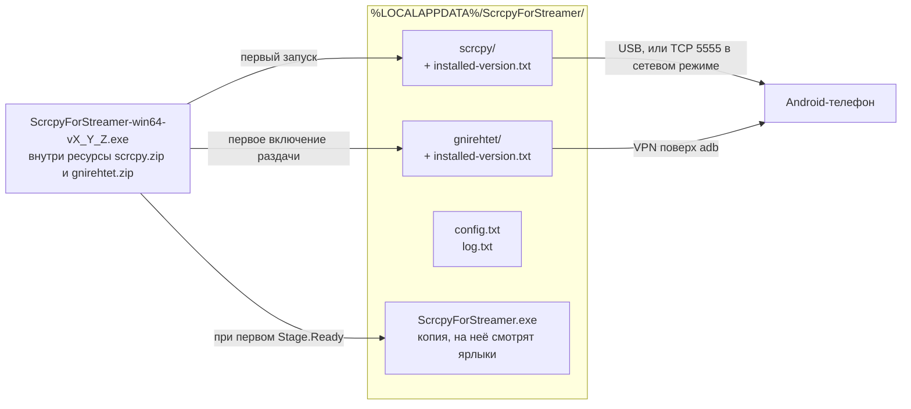

# Карта проекта ScrcpyForStreamer

Короткая справка: то, что нельзя вычитать из кода за пять минут, и то, что не
устареет при первом же рефакторинге. Всё остальное — в самом коде, он целиком
лежит в одном файле [ScrcpyForStreamer.cs](../ScrcpyForStreamer.cs).

## Что это такое

GUI-обёртка под Windows вокруг [scrcpy](https://github.com/Genymobile/scrcpy):
выводит экран Android-телефона на компьютер. Задача — чтобы справился человек,
который почти не пользуется ПК: один exe без установщика, без прав
администратора, пошаговый мастер вместо настроек.

scrcpy и gnirehtet вшиты внутрь exe ресурсами и распаковываются сами при первом
запуске. Отсюда размер файла (~12 МБ) и полное отсутствие зависимостей у
пользователя, кроме предустановленного .NET Framework 4.5+ (на Windows 10/11 стоит 4.8).

Раньше программа называлась `PhoneScreen` и хранила данные в `%LOCALAPPDATA%\PhoneScreen\`.
Теперь имя одно везде. При первом запуске срабатывает `Migration.RunOnce`: переносит
`config.txt`, удаляет старые ярлыки и убирает старую папку. Единственное место, где старое
имя осталось намеренно, — класс `Migration`.

## Что где лежит в рантайме



Всю папку можно удалить — программа создаст её заново.

## Точки входа

`Program.Main`, помечен `[STAThread]`. Два режима, у каждого свой mutex,
поэтому они могут работать одновременно и оба пишут в один `config.txt`
(отсюда `Config.SaveSettingsOnly` и `Wizard.ReloadSettings`):

| Запуск | Окно | Mutex |
|---|---|---|
| без аргументов | `Wizard` | `Local\ScrcpyForStreamer_main` |
| `--settings` | `SettingsForm` | `Local\ScrcpyForStreamer_settings` |

Два ярлыка на рабочем столе — это ровно эти два режима.

## Три вещи, которые ломаются молча

### 1. Кодировка исходника

`ScrcpyForStreamer.cs` — UTF-8 **без BOM**, внутри сотни русских литералов. Легаси
`csc.exe` без BOM читает файл в ANSI-кодировке системы, и весь интерфейс
превращается в кракозябры. **Сборка при этом проходит успешно.** Поэтому в
`build.bat` обязателен `/codepage:65001`, а в CI есть шаг, который ищет строку
«Телефон» в UTF-16 внутри байтов собранного exe.

Никогда не добавлять BOM и не пересохранять файл в другой кодировке.
Проверка: `head -c 3 ScrcpyForStreamer.cs | xxd -p` → `2f2f20`, а не `efbbbf`.

### 2. Версия каждой зависимости сидит в трёх местах

| Зависимость | Константа в коде | Архив | Сумма |
|---|---|---|---|
| scrcpy | `Paths.Version` | `deps/scrcpy-win64-v*.zip` | `deps/SHA256SUMS.txt` |
| gnirehtet | `Paths.NetVersion` | `deps/gnirehtet-rust-win64-v*.zip` | `deps/SHA256SUMS.txt` |

По константе пишется и сверяется маркер `installed-version.txt` в рабочей папке.
Забыть константу при обновлении архива = у всех, кто уже пользовался программой,
навсегда останется старая распакованная версия: файлы на месте, маркер совпал,
распаковка пропущена. Сборка и релиз при этом проходят как ни в чём не бывало.

С августа 2026 расхождение ловит CI — шаг «Сверить версии зависимостей с
константами в коде»: он разбирает версию из имени архива, сверяет с константой
и заодно проверяет, что `build.bat` ссылается на этот же файл.

Порядок обновления зависимости: заменить архив → `cd deps && sha256sum *.zip >
SHA256SUMS.txt` → поправить имя в `build.bat` → поправить константу → поправить
ссылки в **обеих** языковых секциях README.

### 3. Копия программы называется без номера версии

`Paths.SelfCopy` = `%LOCALAPPDATA%\ScrcpyForStreamer\ScrcpyForStreamer.exe`. Оба ярлыка на
рабочем столе указывают на неё. Добавить туда версию — и после первого же
обновления ярлыки у всех пользователей будут вести в никуда.

## Сборка

Только на Windows: `.csproj` нет, сборка — прямой вызов `csc.exe` из
`build.bat`. `dotnet build`, `msbuild` и `mono` неприменимы. Компилятор уровня
**C# 5**: нельзя `$"..."`, `nameof`, `=>`-тела у методов и свойств, `?.`,
pattern matching, `out var`, кортежи.

```
build.bat                    # -> dist\ScrcpyForStreamer-win64-v1_0_0.exe
set VER=1_0_2 && build.bat   # с явной версией
```

Если Windows под рукой нет, единственный способ проверить изменения — прогнать
workflow вручную: Actions → «build & release» → Run workflow. Релиз при этом не
создаётся, exe остаётся артефактом.

## Релиз

```bash
git tag -a 1.0.2 -m "ScrcpyForStreamer 1.0.2"
git push origin 1.0.2
```

Дальше всё делает CI. Тег — через точки, без префикса `v` (маска
`[0-9]+.[0-9]+.[0-9]+`, так что `v1.0.2` не сработает), имя файла релиза — через
подчёркивания. Перевод одного в другое CI делает сам, руками имя не набирается.

Ручной прогон (`workflow_dispatch`) релизом не является и называет файл по коммиту —
`ScrcpyForStreamer-win64-dev-<короткий-sha>.exe`, — чтобы его нельзя было принять за выпуск.
Имя выходного файла задаётся переменной `LABEL`; локальный `build.bat` без неё берёт `v%VER%`.

## Чего в проекте нет

Тестов, `.csproj`/`.sln`, NuGet, LINQ, `async/await`, сторонних C#-библиотек,
сгенерированных файлов. Единственные автопроверки — три шага CI: суммы архивов,
версии зависимостей, кодировка собранного exe.

## Что нельзя редактировать руками

`deps/*.zip` — официальные сборки Genymobile, побайтово; любая правка ломает
суммы. `LICENSE-scrcpy.txt` и `LICENSE-gnirehtet.txt` — чужие лицензии,
обязательны юридически. `deps/SHA256SUMS.txt` — только вместе с заменой архива
и только настоящими суммами.
